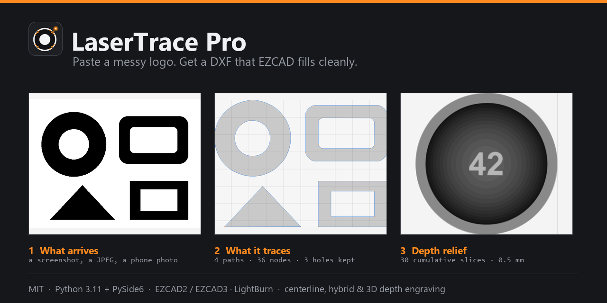
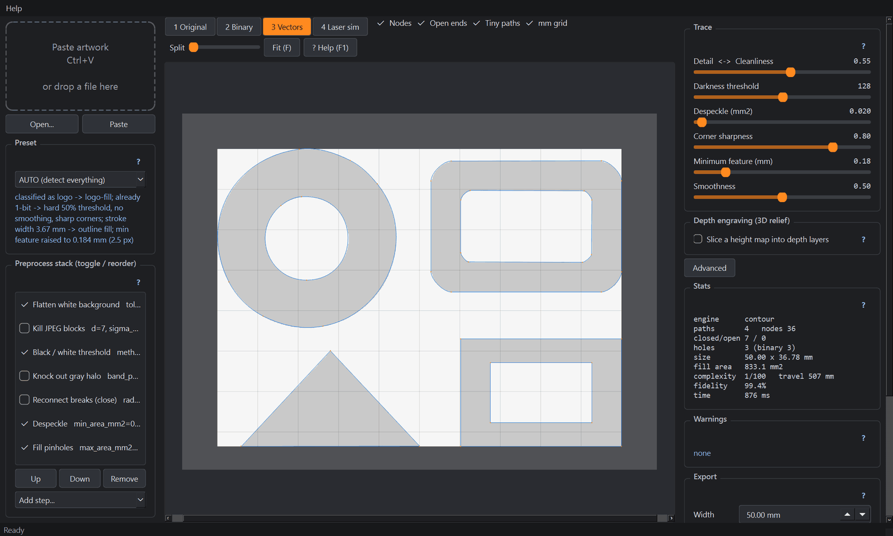
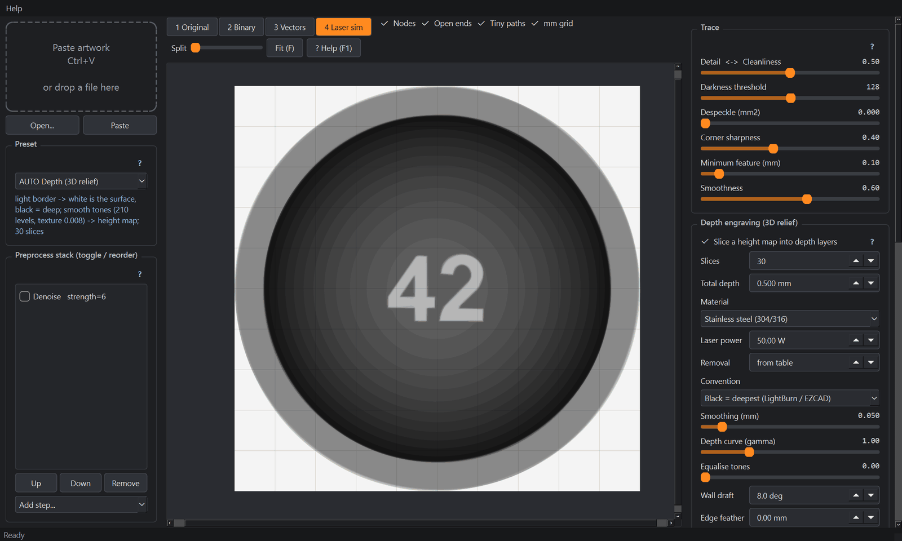
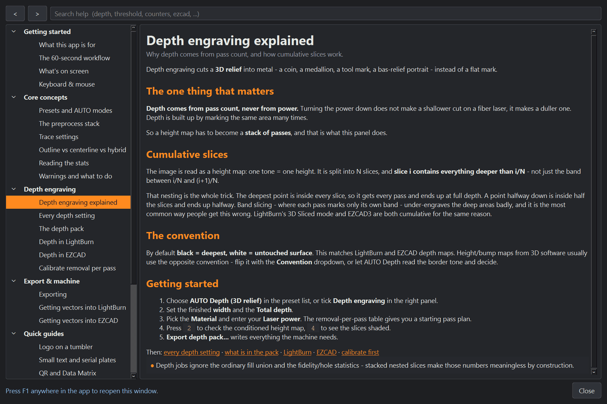

<div align="center">


# LaserTrace Pro

**Paste a messy logo. Get a DXF that EZCAD fills cleanly.**

A black-and-white image vectorizer built for **fiber laser marking shops** —
EZCAD2/3, JCZ galvo controllers, LightBurn. Not a drawing program, not a
general-purpose tracer: every default exists because of something that goes
wrong on the machine.

[](https://github.com/JuicedSystems/lasertrace-pro/actions/workflows/ci.yml)
[](LICENSE)
[](https://www.python.org/)
[](https://doc.qt.io/qtforpython/)
[](#exports)
[](CONTRIBUTING.md)



</div>

---

## Contents

[What it's for](#what-its-for) ·
[Why not Image Trace](#why-not-illustrator-image-trace-or-vector-magic) ·
[See it](#see-it) ·
[Install](#install) ·
[60-second tour](#60-second-tour) ·
[Depth engraving](#depth-3d-relief-engraving) ·
[CLI](#headless-cli) ·
[Presets](#presets-shop-names) ·
[Help](#help-lives-in-the-app) ·
[Testing](#regression-harness) ·
[Docs](#documentation) ·
[Roadmap](#status-and-roadmap) ·
[License](#license)

## What it's for

| | Job | Start here |
|---|---|---|
| 🏷️ | **Customer logo → mark file.** Somebody emails a JPEG. Paste it, export a DXF at the exact millimetre width the part needs. | `auto` |
| 🔤 | **Small text and serial plates.** Counters (the holes in a, e, o, 8) survive and serifs stay sharp at 2 mm cap height. | `small-text` |
| ▦ | **Codes that must scan.** QR and Data Matrix modules stay square, separate and un-rounded. | `qr-datamatrix` |
| ✒️ | **Line art and signatures.** One stroke down the middle of each line instead of a hollow outline pair. | `thin-line-art` |
| ✂️ | **Cut outside, engrave inside.** Silhouette on `CUT`, detail on `ENGRAVE`, one file. | `cut-outer-engrave-inner` |
| 🪙 | **Depth (3D relief) engraving.** A height map or a photo becomes a stack of cumulative passes with a real pass plan in mm and µm. | `auto-depth` |
| 🔁 | **Repeatable shop jobs.** Save what worked as `customer-acme-tumbler`, or drive the same pipeline headless over a folder. | *Save preset* |

## Why not Illustrator Image Trace or Vector Magic

Those tools optimise for how a shape *looks on screen*. A laser cares about
different things:

| Problem on the laser | LaserTrace Pro |
|---|---|
| 400-node "potato" circles, slow EZCAD import | Straight runs become lines, curves become a handful of Béziers. A circle is ~20 nodes at 50 mm; a rounded rectangle is 4 lines + 4 arcs. |
| Thin strokes traced as hollow outline pairs | **Centerline engine**: skeleton + junction-aware graph walk. One path per stroke, with the measured stroke width. **Hybrid** sends fills to outline and thin strokes to centerline automatically. |
| Overlapping shapes double-burn | Planar union of every same-layer fill. Zero overlap area is a quality gate. |
| Counters in A, B, O, 8 fill in | Holes come straight from the raster topology and are re-checked against the binary — the app warns if one was lost. |
| Speckle, JPEG blocks, grey halos become junk vectors | Non-destructive preprocess stack: despeckle in mm², halo knockout, bilateral, Sauvola with a global guard, deskew. |
| "Paths 50 %, Corners 60 %" | Controls in shop units: **Minimum feature (mm)**, **Despeckle (mm²)**, **Darkness threshold**, **Detail vs cleanliness**, **Corner sharpness**, **Smoothness**. |
| SVG in px that EZCAD mangles | DXF R2000/R12 in mm with `$INSUNITS=4`, Y-up, closed LWPOLYLINEs, layers `ENGRAVE_FILL / ENGRAVE_LINE / CUT / SCORE`. Also SVG, HPGL/PLT, PDF, 1-bit PNG. |
| No idea what will fail on the machine | Live stats and operator warnings: unclosed fills, holes lost, outline pairs suspected, tiny paths, node budget exceeded. |
| Grayscale "3D" that only changes colour | Real [depth engraving](#depth-3d-relief-engraving): cumulative slices, wall draft, rotating hatch, Z steps and loop counts from a per-material removal table. |

## See it

**Trace view** — vectors over the source, with every node marked. The stats
panel is the part that matters: 4 paths, 36 nodes, 3 holes kept, 99.4 %
fidelity, complexity 1/100.



**Depth view** — the same window running a coin relief: 30 cumulative slices
shaded light-to-dark, with the pass plan and material numbers on the right.



## Install

### Download the app (no Python needed)

The machine next to the laser shouldn't need a development environment.
Standalone builds are on the
[**releases page**](https://github.com/JuicedSystems/lasertrace-pro/releases):

| Download | For |
|---|---|
| `LaserTracePro-windows-x64.zip` | Windows 10/11 (64-bit) — unzip anywhere, run `LaserTracePro.exe` |
| `LaserTracePro-macos-arm64.zip` | macOS on Apple Silicon (M1 and later) |

**Intel Macs:** there is no app build — GitHub's Intel macOS runner image is
retired, and an Apple Silicon build cannot run on Intel (Rosetta only translates
x86 → ARM, not the reverse). [Install with pip](#install-with-pip) instead; it
is the same program.

> **These builds are unsigned**, so the OS will warn you the first time.
> On **Windows**, SmartScreen says "Windows protected your PC" → *More info* →
> *Run anyway*. On **macOS**, right-click the app → *Open* → *Open*.
> Code-signing needs paid Apple and Microsoft certificates that this project
> doesn't have. If you'd rather not click through a warning, install from
> source below — it's the same program.

### Install with pip

Needs Python **3.11+** and nothing else — no compiler, no system libraries.
Works on Windows, macOS and Linux.


```bash
pip install "lasertrace[ui] @ git+https://github.com/JuicedSystems/lasertrace-pro.git"

lasertrace-ui                                  # desktop app
lasertrace logo.png --width-mm 38 --out logo.dxf   # or the CLI
```

Both commands land on your PATH. Drop the `[ui]` extra for the **core only** —
the tracer and CLI have no Qt dependency at all, which is what you want on a
server or in a batch job.

> Prefer a virtual environment so this doesn't touch your system Python:
> `py -3.11 -m venv .venv` then `.\.venv\Scripts\pip install ...` on Windows,
> or `python3.11 -m venv .venv` then `./.venv/bin/pip install ...` elsewhere.

### Work on it

<details open>
<summary><b>Windows (PowerShell)</b></summary>

```powershell
git clone https://github.com/JuicedSystems/lasertrace-pro.git
cd lasertrace-pro
py -3.11 -m venv .venv
.\.venv\Scripts\pip install -r requirements-ui.txt   # editable install + deps + pytest

.\.venv\Scripts\python -m lasertrace_ui.main
```
</details>

<details>
<summary><b>macOS / Linux</b></summary>

```bash
git clone https://github.com/JuicedSystems/lasertrace-pro.git
cd lasertrace-pro
python3.11 -m venv .venv
./.venv/bin/pip install -r requirements-ui.txt        # editable install + deps + pytest

./.venv/bin/python -m lasertrace_ui.main
```
</details>

Then run the tests — green straight from a clone, because the fixture set is
committed:

```bash
pytest            # 118 tests, ~2 minutes
```

Every push runs that suite on **Linux, macOS and Windows × Python 3.11 and
3.12**, then builds a wheel, installs it into a clean virtualenv and runs it
from outside the source tree — because an editable install will happily hide a
packaging bug that breaks everyone else. You can run that last check yourself:

```bash
cd /tmp && python /path/to/repo/tools/verify_install.py
```

Use `requirements.txt` instead for the headless core. Both files just install
the project's own extras, so [`pyproject.toml`](pyproject.toml) stays the
single source of truth for versions.

## 60-second tour

1. **`Ctrl+V`** to paste, or drop a file (PNG, JPG, WEBP, BMP, TIF, GIF, PDF, SVG).
2. Leave the preset on **AUTO** — it measures the artwork and writes down every
   decision it made in the blue note (*"classified as logo → logo-fill; already
   1-bit → hard 50 % threshold; stroke width 3.67 mm → outline fill"*).
3. Type the finished **width in mm**. Everything else is in real millimetres,
   so do this early.
4. Press **`2`** to check the binary and **`3`** to check the vectors. Most bad
   traces are bad binaries.
5. Read the **warnings**. Red is a problem the machine will show you; amber is
   one the customer will.
6. **`E`** exports a DXF, or **Copy SVG** puts the vectors straight on the
   clipboard for LightBurn.

`Space` toggles the original · `[` `]` nudge the threshold · `Enter` re-traces ·
`Ctrl+Z`/`Ctrl+Y` walk the whole settings history · `F1` opens the handbook.

## Depth (3D relief) engraving

Depth on a fiber laser comes from **pass count, never from power**. So a height
map has to become a stack of passes — and they have to be **cumulative**: slice
*i* contains everything deeper than *i*/N, not just the band between *i*/N and
(*i*+1)/N. That nesting is what makes the deepest point receive every pass.
Band slicing under-engraves deep areas, and it is the most common way people
get this wrong. LightBurn's 3D Sliced mode and EZCAD3 are cumulative for the
same reason.

LaserTrace Pro takes a grey height map — or a photo, run through gradient
compression so luminance stops being mistaken for height — and produces:

```
<stem>_depth.dxf            one layer + colour per slice (LightBurn keys on colour, EZCAD3 on name)
slices/<stem>_DEPTH_nn.dxf  one file per slice, all sharing an IGNORE alignment frame (EZCAD2)
<stem>_heightmap.png        8/16-bit, black = deepest, DPI set from the hatch pitch
<stem>_preview.png          shaded relief preview
<stem>_plan.md / .csv / .json   pass plan: depths, Z offsets, loop counts, angles, time
```

…with wall draft on every slice, a hatch angle that rotates by 37° (never a
divisor of 180, or the same lines repeat and cut grooves), and Z steps plus
loop counts derived from a per-material removal table you can override with
your own measured µm/pass.

Full write-up, including the measured removal figures and the exact LightBurn /
EZCAD2 / EZCAD3 setup steps: **[docs/DEPTH_ENGRAVING.md](docs/DEPTH_ENGRAVING.md)**.

## Headless CLI

```powershell
lasertrace logo.png --preset logo-fill --width-mm 50 --out logo.dxf
lasertrace logo.png --out logo.dxf --out logo.svg --stats logo.json         # auto-classify preset
lasertrace sketch.jpg --preset thin-line-art --out sketch.dxf               # centerline
lasertrace tag.png --preset cut-outer-engrave-inner --out tag.dxf           # CUT silhouette + ENGRAVE
lasertrace qr.png --preset qr-datamatrix --width-mm 20 --out qr.dxf         # square modules, no smoothing
lasertrace --batch .\incoming --out-dir .\vectors --preset logo-fill --format dxf,svg
lasertrace --list-presets
lasertrace photo.jpg --classify

# depth: height map -> DEPTH_01..NN layers + the full pack
lasertrace relief.png --preset auto-depth --width-mm 40 --out relief.dxf --depth-pack .\relief_pack
lasertrace coin.png --preset depth-coin --depth-mm 0.3 --material brass --laser-w 60 --removal-um 12 --depth-pack .\coin
lasertrace face.jpg --preset depth-photo-relief --out face_heightmap.png    # LightBurn 3D Sliced input
```

<a name="exports"></a>Every UI control has a CLI flag (`--detail`,
`--smoothness`, `--corner`, `--min-feature-mm`, `--despeckle-mm2`,
`--threshold`, `--node-budget`, `--engine`, `--mode`, `--dxf-version`,
`--curves`, `--origin`). **Same image + same preset = byte-identical
geometry**, so batch jobs are repeatable and an export you shipped last year
can be reproduced — every file embeds the job settings that made it.

## Presets (shop names)

**AUTO modes** measure the image and derive the settings, then leave the
sliders editable and show their reasoning: `auto` (detect everything),
`auto-bw` (already black & white, or white on black), `auto-photo` (photos and
scans, tuned from measured noise), `auto-lines` (line art), `auto-depth`
(height maps and photo reliefs).

**Static presets:** `logo-fill`, `thin-line-art`, `stamp-stencil`,
`photo-to-plate`, `small-text`, `qr-datamatrix`, `dirty-phone-photo`,
`cut-outer-engrave-inner`, `tiny-logo`, `depth-relief`, `depth-coin`,
`depth-photo-relief`.

Each is a JSON file in
[`lasertrace/preset_data/`](lasertrace/preset_data) — copy one as a starting
point. **Your own presets belong in `~/.lasertrace/presets/`**, which is
searched first and survives upgrades (the *Save preset* button writes there).
See [docs/PRESETS.md](docs/PRESETS.md).

## Help lives in the app

Press **F1** (or the *? Help* button on the view bar) for a searchable,
29-topic handbook: what every control does, how depth engraving works, what
each warning means and how to fix it, and step-by-step quick guides for the
jobs a shop actually runs. Every panel has a small **?** that opens its own
topic.



The content is plain text in
[`lasertrace_ui/help_content.py`](lasertrace_ui/help_content.py) — corrections
and new topics are easy PRs.

## Regression harness

Quality here is *measured*, not eyeballed:

```powershell
python tools/regress.py
```

Traces all 38 fixtures (35 flat + 3 height maps), writes `reports/metrics.csv`
and red/blue overlays in `reports/overlays/`, and **fails** if any preset
exceeds 3× its hand-set node target, loses a hole, leaves a fill open, drops
below 85 % fidelity, or produces overlapping fills. Depth fixtures are gated on
slice count, nesting (slice *i*+1 inside slice *i*) and closed paths instead.

The bar the tracer currently holds: a circle in **4 nodes**, a rounded
rectangle in **4 lines + 4 arcs**, a ring in **8**, a geometric logo in **36**,
and bold text in **59** with all nine counters intact.

## Documentation

| Document | What's in it |
|---|---|
| [ARCHITECTURE.md](docs/ARCHITECTURE.md) | Modules, data flow, coordinate systems, file formats |
| [LASER_REQUIREMENTS.md](docs/LASER_REQUIREMENTS.md) | EZCAD / LightBurn constraints, layer colours, DXF rules |
| [TRACE_STRATEGY.md](docs/TRACE_STRATEGY.md) | Outline vs centerline vs hybrid, algorithm notes, roadmap |
| [DEPTH_ENGRAVING.md](docs/DEPTH_ENGRAVING.md) | The physics, the research and its sources, the machine workflow |
| [PRESETS.md](docs/PRESETS.md) | Every preset and its parameters |
| [TECH_STACK.md](docs/TECH_STACK.md) | Stack and licence audit |
| [EZCAD_VERIFY.md](docs/EZCAD_VERIFY.md) | How to verify an export in EZCAD |
| [BUILDING.md](docs/BUILDING.md) | Building the standalone Windows / macOS apps |

The in-app help (**F1**) is the operator-facing summary of all of these.

## Status and roadmap

**Working today:** paste/open → preprocess stack → contour, centerline, hybrid
or Potrace-sidecar trace → hygiene → four views → DXF/SVG/PLT/PDF/PNG export,
with AUTO modes, a headless CLI, batch mode, a 38-fixture regression suite, 118
tests, depth (3D relief) engraving end to end, and standalone Windows / macOS
builds.

**Next:** geometry snap (recognising true circles, arcs and H/V/45° lines) and
the vtracer engine. See the roadmap in
[docs/TRACE_STRATEGY.md](docs/TRACE_STRATEGY.md).

**Honest limits:** the tracer is black-and-white only — no colour separation.
Photo-to-plate output is a readable silhouette, not photoreal. Depth time
estimates are only as good as your measured µm/pass, so
[calibrate first](docs/DEPTH_ENGRAVING.md). EZCAD imports were verified against
the format spec and reference files rather than on a live machine — bug reports
from real controllers are very welcome.

## Contributing

Issues and pull requests are welcome — including "this file broke my EZCAD
import", which is the most useful bug report this project can get. Start with
[CONTRIBUTING.md](CONTRIBUTING.md).

## License

**MIT** — free to use, modify and sell, commercially or otherwise. See
[LICENSE](LICENSE).

Two deliberate constraints keep it that way:

- `sidecars/potrace_sidecar/` is **GPL-3**, so Potrace is invoked as a separate
  process and never imported into the core. Everything works without it.
- PyMuPDF (AGPL) is not used anywhere; PDF input goes through pypdfium2.

See [NOTICE](NOTICE) for third-party terms and
[docs/TECH_STACK.md](docs/TECH_STACK.md) for the full dependency licence audit.
